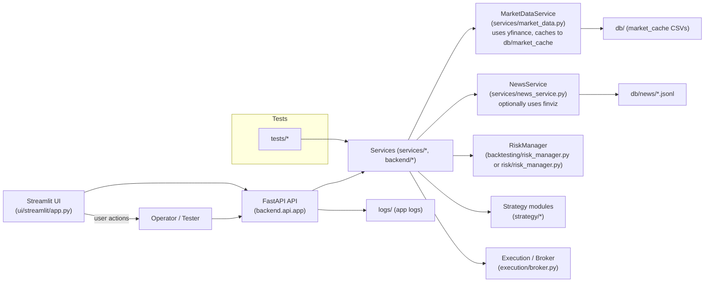

# Architecture (Mermaid) 🔧

This page shows a simple component diagram of the project.

### Notes
- The `MarketDataService` caches OHLC CSVs under `db/market_cache` and normalizes timestamps to UTC. ⚡
- The `NewsService` stores raw JSON lines under `db/news` when finviz is available. 🗞️
- The repo includes a Streamlit UI for monitoring and a FastAPI backend for programmatic access. 🎛️
